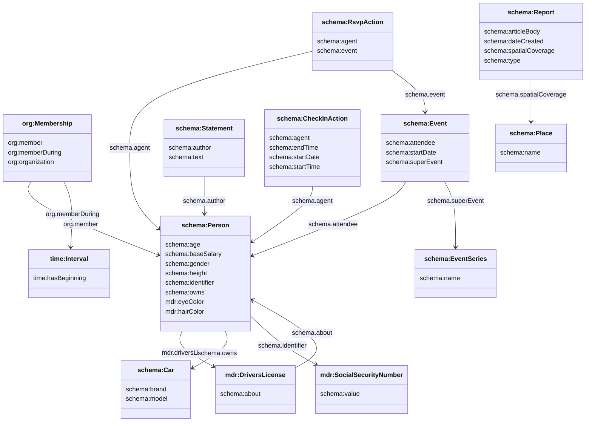

```sh
docker build . --tag r2rml
docker run --rm -v $PWD:/workspace -w /workspace -it r2rml config.properties
```


```mermaid
classDiagram
    class `org:Membership` {
        org:member
        org:memberDuring
        org:organization
    }
    class `time:Interval` {
        time:hasBeginning
    }
    class `schema:RsvpAction` {
        schema:agent
        schema:event
    }
    class `schema:EventSeries` {
        schema:name
    }
    class `schema:Event` {
      schema:attendee
      schema:startDate
      schema:superEvent
    }
    class `schema:Person` {
        schema:age
        schema:baseSalary
        schema:gender
        schema:height
        schema:identifier
        schema:owns
        mdr:eyeColor
        mdr:hairColor
    }
    class `mdr:SocialSecurityNumber` {
        schema:value
    }
    class `schema:Statement` {
        schema:author
        schema:text
    }
    class `schema:CheckInAction` {
        schema:agent
        schema:endTime
        schema:startDate
        schema:startTime
    }
    class `mdr:DriversLicense` {
        schema:about
    }
    class `schema:Car` {
        schema:brand
        schema:model
    }
    class `schema:Place` {
        schema:name
    }
    class `schema:Report` {
        schema:articleBody
        schema:dateCreated
        schema:spatialCoverage
        schema:type
    }


    `schema:Event` --> `schema:Person` : schema.attendee
    `schema:Event` --> `schema:EventSeries` : schema.superEvent
    `mdr:DriversLicense` --> `schema:Person` : schema.about
    `schema:Person` --> `mdr:DriversLicense` : mdr.driversLicense
    `schema:Person` --> `schema:Car` : schema.owns
    `schema:Person` --> `mdr:SocialSecurityNumber` : schema.identifier
    `schema:Statement` --> `schema:Person` : schema.author
    `schema:RsvpAction` --> `schema:Person` : schema.agent
    `schema:RsvpAction` --> `schema:Event` : schema.event
    `schema:CheckInAction` --> `schema:Person` : schema.agent
    `org:Membership` --> `schema:Person` : org.member
    `org:Membership` --> `time:Interval` : org.memberDuring
    `schema:Report` --> `schema:Place` : schema.spatialCoverage

```
